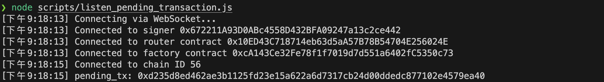
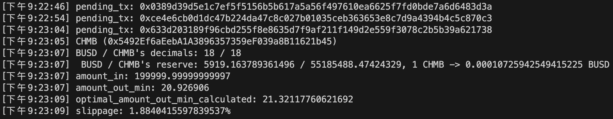

### Install Required Modules
``` shell
    $ npm install --save-dev hardhat
    $ npm install --save-dev @nomiclabs/hardhat-ethers 
    $ npm install @openzeppelin/contracts
    $ npm install --save-dev @nomiclabs/hardhat-etherscan
    $ npm install dotenv --save-dev
    $ npm install chai --save-dev
```

### Demo
``` shell
    $ node scripts/listen_pending_transaction.js
```




### Report
[Sandwitch Attack on Pancakeswap V2](https://docs.google.com/presentation/d/1k1JUhJ5bDpUaBilctMYmURTXiCFIcYgXHrl3T08L4Ek/edit#slide=id.p)


### Pending Transaction
pendingTx: {
    hash: '0xe9fc7eaa9c834cc8bba90e7cc828f618ee87457d357d6c3dcf46b54eaeeb8feb',
    type: 0,
    accessList: null,
    blockHash: null,
    blockNumber: null,
    transactionIndex: null,
    confirmations: 0,
    <span style="color:orchid"> from: '0xCdd038774ae8B3d1CF823922091fB1A39FA6E29A', </span>
    gasPrice: BigNumber { _hex: '0xb2d05e00', _isBigNumber: true },
    gasLimit: BigNumber { _hex: '0x0451c9', _isBigNumber: true },
    to: '0x10ED43C718714eb63d5aA57B78B54704E256024E',
    <span style="color:deepskyblue"> value: BigNumber { _hex: '0x016345785d8a0000', _isBigNumber: true }, </span> 
    nonce: 4578,
    data: '<span style="color:lightgreen">0xb6f9de95</span> 0000000000000000000000000000000000000000000000<span style="color:orange">54ff9e349e47315081</span> 0000000000000000000000000000000000000000000000000000000000000080000000000000000000000000<span style="color:orchid">cdd038774ae8b3d1cf823922091fb1a39fa6e29a</span>00000000000000000000000000000000000000000000000000000000<span style="color:pink">6482b628</span>0000000000000000000000000000000000000000000000000000000000000002000000000000000000000000<span style="color:gold">bb4cdb9cbd36b01bd1cbaebf2de08d9173bc095c</span>000000000000000000000000<span style="color:gold">a6d2ec4c126421cf775884a0ab91cb6d90618de5</span>',
    r: '0xb666b6b464e5235cee26bc6257278dc41e279bc93476b0940183489c14364d1e',
    s: '0x0b361835b3f58bbbfa986671da6be0b9a9e62f0f891675036e31f4dd23d8a22e',
    v: 147,
    creates: null,
    chainId: 56,
    wait: [Function (anonymous)]
}


decodedData:
TransactionDescription {
    args: [
        <span style="color:orange">BigNumber { _hex: '0x54ff9e349e47315081', _isBigNumber: true }</span>,
        <span style="color:gold">[
        '0xbb4CdB9CBd36B01bD1cBaEBF2De08d9173bc095c',
        '0xA6D2eC4c126421cF775884a0aB91Cb6D90618de5'
        ]</span>,
        <span style="color:orchid">'0xCdd038774ae8B3d1CF823922091fB1A39FA6E29A'</span>,
        <span style="color:pink">BigNumber { _hex: '0x6482b628', _isBigNumber: true }</span>,
        <span style="color:orange">amountOutMin: BigNumber { _hex: '0x54ff9e349e47315081', _isBigNumber: true }</span>,
        <span style="color:gold">path: [
        '0xbb4CdB9CBd36B01bD1cBaEBF2De08d9173bc095c',
        '0xA6D2eC4c126421cF775884a0aB91Cb6D90618de5'
        ]</span>,
        <span style="color:orchid">to: '0xCdd038774ae8B3d1CF823922091fB1A39FA6E29A'</span>,
        <span style="color:pink">deadline: BigNumber { _hex: '0x6482b628', _isBigNumber: true }</span>
    ],
    functionFragment: {
        type: 'function',
        name: 'swapExactETHForTokensSupportingFeeOnTransferTokens',
        constant: false,
        inputs: [ [ParamType], [ParamType], [ParamType], [ParamType] ],
        outputs: [],
        payable: true,
        stateMutability: 'payable',
        gas: null,
        _isFragment: true,
        constructor: [Function: FunctionFragment] {
        from: [Function (anonymous)],
        fromObject: [Function (anonymous)],
        fromString: [Function (anonymous)],
        isFunctionFragment: [Function (anonymous)]
        },
        format: [Function (anonymous)]
    },
    name: 'swapExactETHForTokensSupportingFeeOnTransferTokens',
    signature: 'swapExactETHForTokensSupportingFeeOnTransferTokens(uint256,address[],address,uint256)',
    <span style="color:lightgreen">sighash: '0xb6f9de95'</span>,
    <span style="color:deepskyblue">value: BigNumber { _hex: '0x016345785d8a0000', _isBigNumber: true }</span>
}

### References
1. [How to listen to pending transactions using Ethers.js](https://www.showwcase.com/show/14647/how-to-listen-to-pending-transactions-using-ethersjs)
2. [How to decode transactions data using Ethers.js](https://www.showwcase.com/show/14799/how-to-decode-transactions-data-using-ethersjs)
3. [Ethereum Signature Database](https://www.4byte.directory/)
4. [Uniswap Router Documentation](https://docs.uniswap.org/contracts/v2/reference/smart-contracts/router-02)
5. [Uniswap Router Source Code](https://github.com/Uniswap/v2-periphery/blob/master/contracts/UniswapV2Router02.sol)
6. [Pancakeswap Router Documentation](https://docs.pancakeswap.finance/developers/smart-contracts/pancakeswap-exchange/v2-contracts/router-v2)
7. [Pancakeswap Router Source Code](https://github.com/pancakeswap/pancake-smart-contracts/blob/master/projects/exchange-protocol/contracts/PancakeRouter.sol)
8. [where can i find the addresses of the pancakeswap coin pairs smart contracts](https://ethereum.stackexchange.com/questions/98014/where-can-i-find-the-addresses-of-the-pancakeswap-coin-pairs-smart-contracts)
9. [BNB Chain Documentation](https://docs.bnbchain.org/docs/overview)
10. [Is there a way to monitor the price on pancake swap through an API?](https://www.reddit.com/r/pancakeswap/comments/mwz72v/is_there_a_way_to_monitor_the_price_on_pancake/?onetap_auto=true)
11. [【BSC】使用Python玩转PancakeSwap（入门篇）](https://blog.csdn.net/CharlesSimonyi/article/details/128067815?ops_request_misc=%257B%2522request%255Fid%2522%253A%2522168588460516800185869085%2522%252C%2522scm%2522%253A%252220140713.130102334..%2522%257D&request_id=168588460516800185869085&biz_id=0&utm_medium=distribute.pc_search_result.none-task-blog-2~all~baidu_landing_v2~default-4-128067815-null-null.142%5Ev88%5Econtrol_2,239%5Ev2%5Einsert_chatgpt&utm_term=pancakeswap%20&spm=1018.2226.3001.4187)
12. [Sandwitch sample in EignePhi](https://eigenphi.io/mev/bsc/tx/0x43173da863d39a5986d09dedba1947f7cc78101065bb1ab10b25387a3fecd2da)
13. [mev-template-rs](https://github.com/degatchi/mev-template-rs/tree/main)
14. [如何搭建BSC币安智能链fullnode全节点，夹子机器人和土狗自动交易机器人必备资源，揭秘为什么你抢NFT总是抢不过别人](https://www.youtube.com/watch?v=H_fzQnMMgck)
15. [Public RPC Nodes on BSC chain](https://docs.bscscan.com/misc-tools-and-utilities/public-rpc-nodes)

