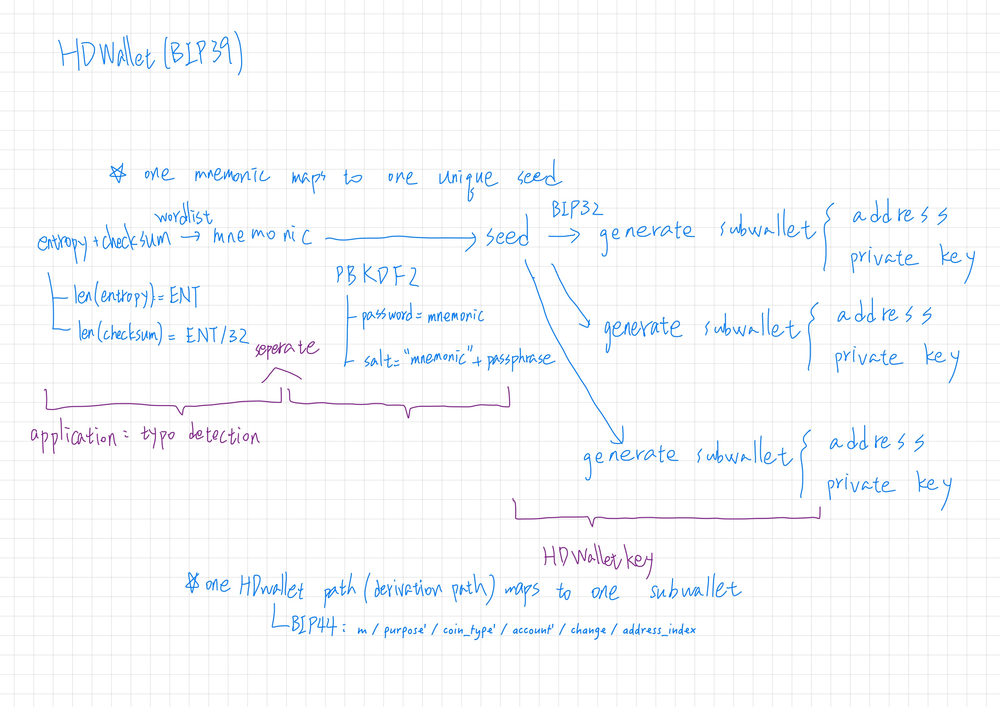

1. Install required module
    ```shell
    $ npm install bip39
    $ npm install ethereumjs-wallet
    ```


2. Run the code with desired prefix
   
    For example,
    ```shell
    $ node hw2_vanity_address_generator.js 0x87
    ```
    
    It means to generate address with 0x87 prefix. The program will continue to find the desirable address until user press ctrl+c.


3. About how HDWallet work
   


4. About how vanity address generator work
    
    Just like the flow of 3. About how HDWallet work. The entropy will be randomly generated until the address of subwallet with /44’/60’/0’/0/ derivation path is starting with desired prefix.

