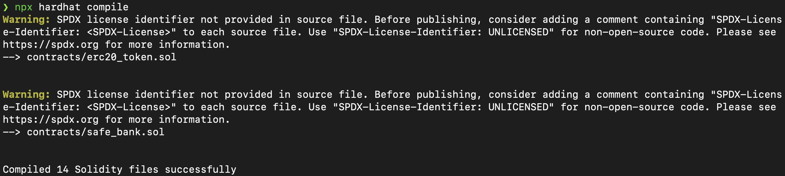
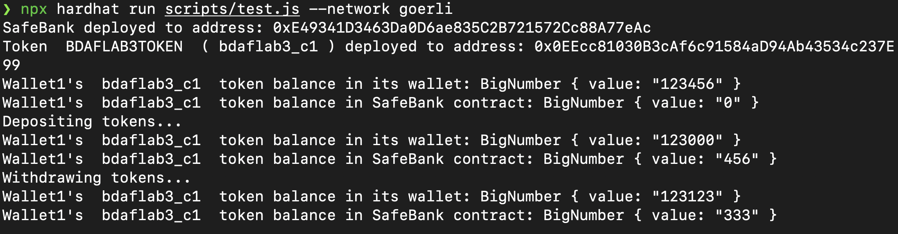
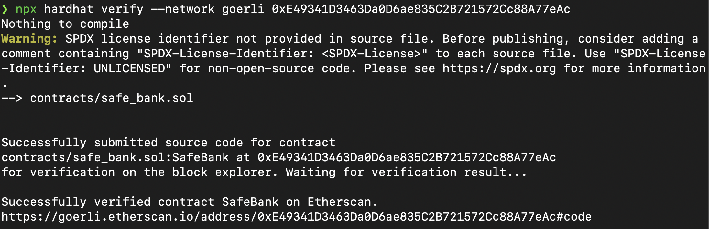
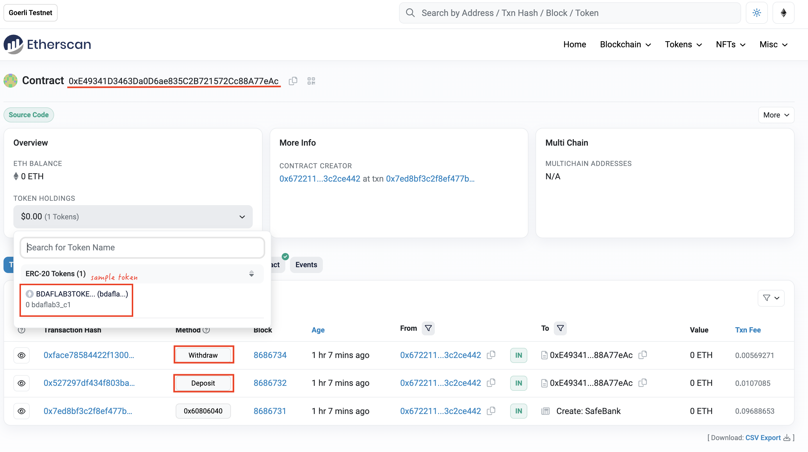
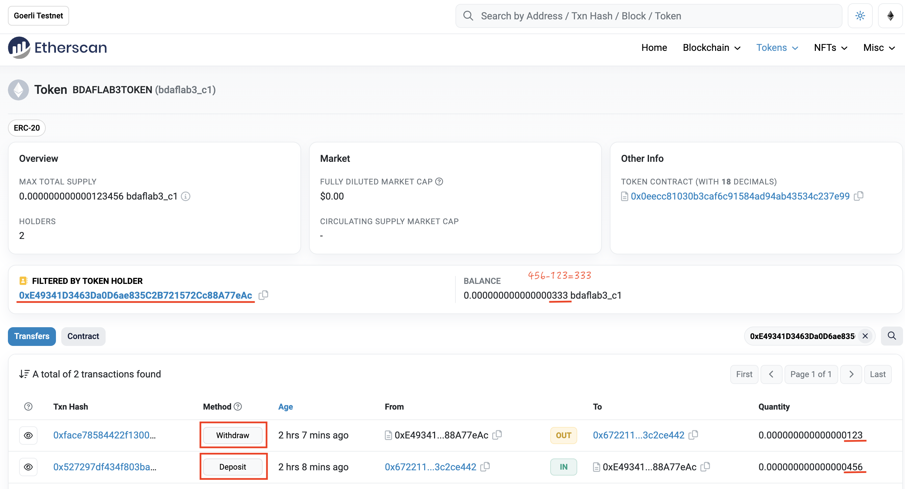

This homework aims to create a simple safe contract that allows everyone to store funds in the contract. The core safe contract is defined in contracts/safe_bank.sol. The sample erc20 toeken is defined in contracts/erc20_token.sol. The test script writes in scripts/test.js. 

Here introduce how to run the code:
1. Install required module
    
    ```shell
    $ npm install --save-dev hardhat
    $ npm install --save-dev @nomiclabs/hardhat-ethers 
    $ npm install @openzeppelin/contracts
    $ npm install ethereum-waffle
    $ npm install --save-dev @nomiclabs/hardhat-etherscan
    ```

2. Run the code
    ```shell
    $ npx hardhat compile # compile the solidaty contract
    $ npx hardhat run scripts/test.js --network goerli # run the test
    $ npx hardhat verify --network ropsten CONTRACT_ADDRESS CONTRACT_ARGS # verify the contract to submit it to etherscan
    ```

3. Demo
    
    
    
    
    


4. About the safety

    a. To prevent overflow/underflow, SafeBank contract use SafeMath library to maintain each account's each token's balance

    b. To prevent access control related attack, SafeBank contract limit the method access permission to owner only.
    
    c. To prevent private key be accessible to everyone, this project use dotnet library, and store all the sensitive data in .env file. You should create the file by yourself and it should contains the following:

        - API_URL # alchemy goerli API url
        - PRIVATE_KEY # metamask private key
        - ETHERSCAN_API_KEY # etherscan api key

5. Reference
   
   a. [hello world smart contract](https://docs.alchemy.com/docs/hello-world-smart-contract)

   b. [hardhat guide](https://hardhat.org/hardhat-runner/docs/guides/deploying)

   c. [openzeppelin](https://github.com/OpenZeppelin/openzeppelin-contracts)