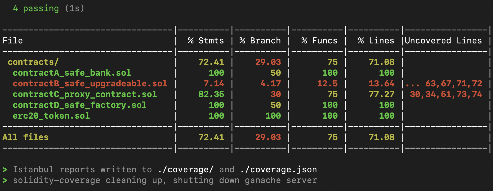
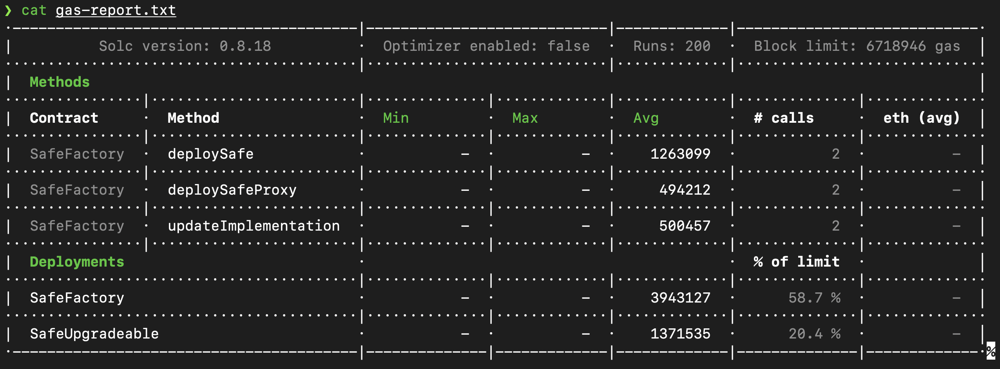

This homework aims to practice proxy pattern.
- contracts/contractA_safe_bank.sol is a modified SafeBank contract of lab3 with addtional function TakeFee.
- contracts/contractB_safe_upgradeable.sol is similar to contractA but with initialization function.
- contracts/contractC_proxy_contract.sol is a proxy contract for contractB with unstructured storage to store “owner” and “implementation”, and only the owner should be able to update the implementation of the proxy.
- contracts/contractD_safe_factory.sol implements SafeFactory contract.

Here introduce how to run the code:
1. Install required module
    
    ```shell
    $ npm install --save-dev hardhat
    $ npm install --save-dev @nomiclabs/hardhat-ethers 
    $ npm install @openzeppelin/contracts
    $ npm install --save-dev @nomiclabs/hardhat-etherscan
    $ npm install bignumber.js
    $ npm install solidity-coverage --save-dev
    $ npm install dotenv --save
    $ npm install chai
    $ npm install ganache-cli --save-dev
    $ npm install hardhat-gas-reporter --save-dev
    ```

    Also, in .env file, you should write: API_URL = "http://127.0.0.1:8545"

2. Run the code
    ```shell
    # solidity converge
    $ npx hardhat compile --network localhost # compile the solidaty contract
    $ npx hardhat coverage --network localhost

    # get the gas reproter
    $ npx hardhat node
    $ npx hardhat test --network localhost
    ```

3. Demo
   
   
   
    
    

4. Reference
   
   a. [solidity-converge](https://www.npmjs.com/package/solidity-coverage)

   b. [hardhat gas reproter](https://www.npmjs.com/package/hardhat-gas-reporter)

   c. [proxy contract1](https://fravoll.github.io/solidity-patterns/proxy_delegate.html), [proxy contract2](https://solidity-by-example.org/app/upgradeable-proxy/)

   d. [unstructured storage](https://blog.openzeppelin.com/upgradeability-using-unstructured-storage/)

   e. [useful solidity pattern - basic proxied](https://github.com/dragonfly-xyz/useful-solidity-patterns/tree/main/patterns/basic-proxies)

   f. [useful solifity pattern - initializing upgradeable contracts](https://github.com/dragonfly-xyz/useful-solidity-patterns/tree/main/patterns/initializing-upgradeable-contracts)
