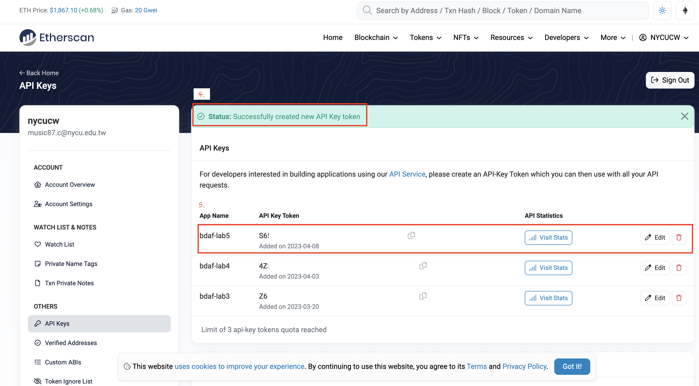
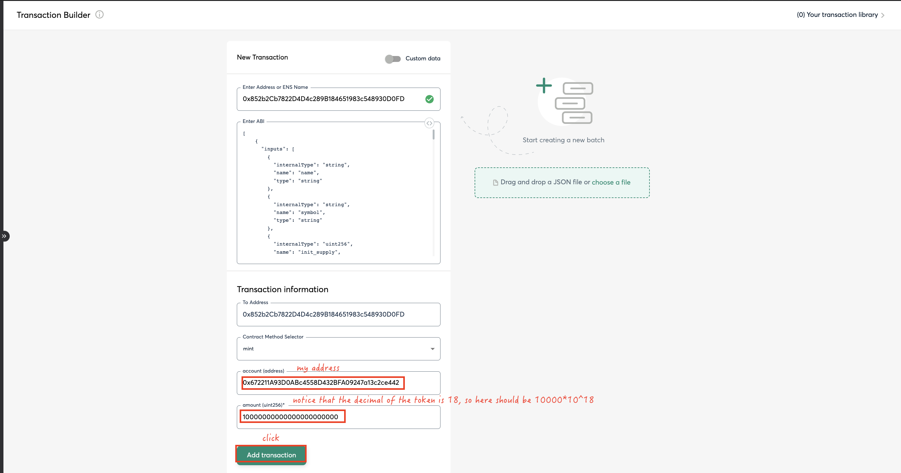
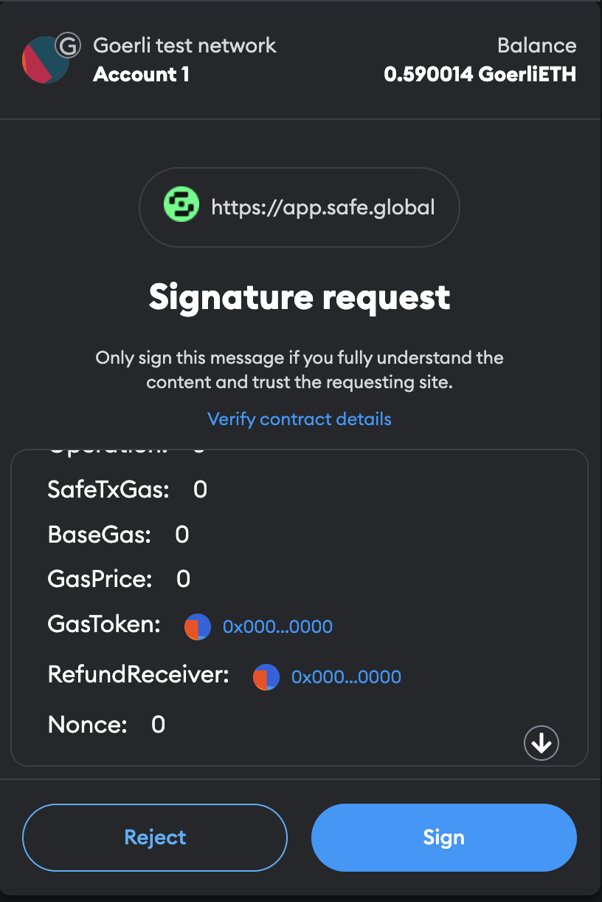
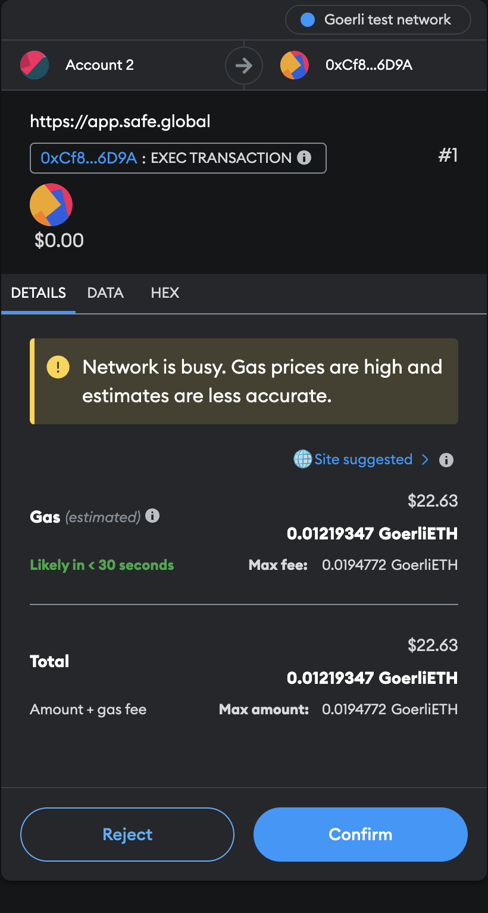
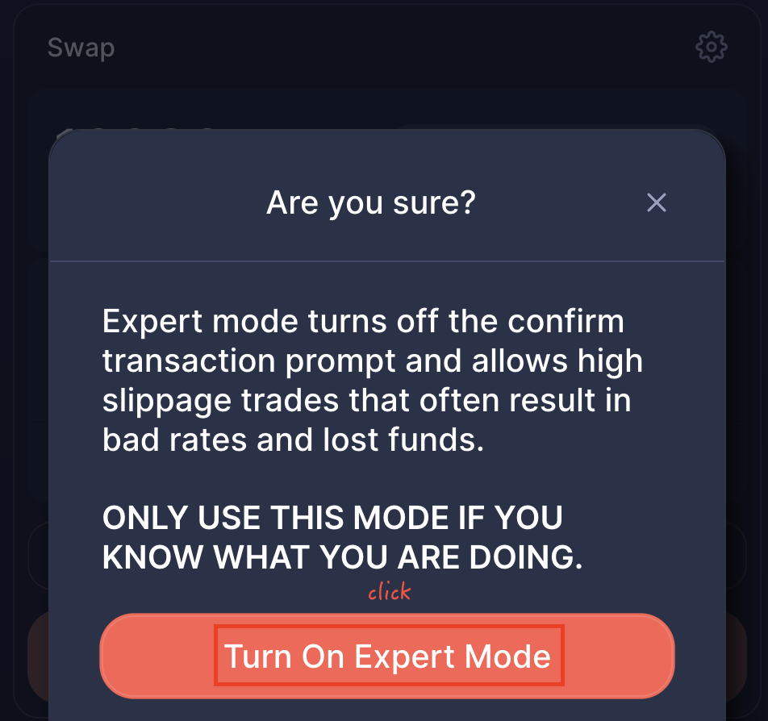

1. Install required modules
   
   ```shell
    $ npm install --save-dev hardhat
    $ npm install --save-dev @nomiclabs/hardhat-ethers 
    $ npm install @openzeppelin/contracts
    $ npm install --save-dev @nomiclabs/hardhat-etherscan
    $ npm install dotenv --save-dev
   ```

    Also, you should create file .env which contains API_URL, API_KEY, PRIVATE_KEY, and ETHERSCAN_API_KEY.
    
    API_URL and API_KEY comes from Alchemy.
    
    
    
    PRIVATE_KEY is your one of metamask wallet's address' private key.
    
    
    
    
    
    ETHERSCAN_API_KEY comes from Etherscan.
    
    
    

2. Develop an ERC20 token: 
   
    - <span style="color:#808080"> 18 decimals. </span>
    - <span style="color:#808080"> Minting and burning capability with onlyOwner access control. </span>
    - <span style="color:#808080"> Ability to transfer ownership </span>
    
    The above functionalities is in contracts/erc20_token.sol
    .</span>
    
3. Deploy your ERC20 token. Mint 1000 tokens (i.e. 1000 * 10^18 units) to yourself. **(Record the address of your own token)**
   
    ```shell
        $ npx hardhat run scripts/deploy.js --network goerli
    ```
    
    

4. Go to Aave, lend ETH and borrow DAI out **(Record your Borrow transaction)**
   
    <span style="color:#808080"> 1. Go to AaveV3 Goerli: [https://staging.aave.com/?marketName=proto_goerli_v3](https://staging.aave.com/?marketName=proto_goerli_v3) </span>
    
    <span style="color:#808080"> 2. On the left, Supply 0.05 ETH. </span>
    
    
    
    <span style="color:#808080"> 3.  Borrow some DAI (50 or 100) </span>
    
    
    
5. Go to Etherscan and get the address of the DAI **(Record the address of the DAI token)**
    - <span style="color:#808080"> As this is a testnet, there are a lot of different versions of DAI, we’re going to use the one you borrowed out from Aave. </span>
    
    
    
6. Go to UniswapV2 to create a new liquidity pair: [https://app.uniswap.org/#/pools/v2](https://app.uniswap.org/#/pools/v2) 
    - <span style="color:#808080"> Make sure you are on Goerli testnet </span>
    
    
    - <span style="color:#808080"> “Add V2 Liquidity” </span>
    
    - <span style="color:#808080"> paste the address of your DAI token you have in one field (the ui should show you that you have some) </span>
    
    
    
    - <span style="color:#808080"> Paste the address of your own token in the other field </span>
    
    
    
    - <span style="color:#808080"> We can actually set the initial price of the token by determining the ratio between DAI and your token: let’s make your token worth 10 DAI by supplying 100 DAI to 10 of your token. (or 50 DAI to 5 of your token). </span>
    

    - <span style="color:#808080"> Approve DAI and your token to Uniswap, and hit the Supply button. (It will ask you to “Create pool and Supply”) </span>
    
    
    
    
    
    
    
    
    
    
    - <span style="color:#808080"> You will receive some pool tokens as per this transaction. Look at your address on Etherscan and determine the address of the token. **(Record the address of the pool token)** </span>
    
    
    
    - <span style="color:#808080"> Try [Swap](https://app.uniswap.org/#/swap), you should be able to swap your token to DAI now. Buy 0.001 of your token now. **(Record the transaction)** </span>
    
    
    
    
    

7. Create a [Safe (Gnosis’s multiSig solution) on Goerli](https://app.safe.global/new-safe/create) **(Record the address of your Safe multiSig address)**
    - <span style="color:#808080"> Have 2 owners in the Safe. You can use Metamask to generate the second address. </span>
    - <span style="color:#808080"> Set the Threshold as 2 out of 2 owners. This means that every time this multiSig is sending a transaction, both of these owners have to sign. </span>
    
    
    
    
    
    
8. Transfer Ownership of your token to your Safe multiSig address. **(Record the transaction)**
    You should set TOKEN_ADDRESS and SAFE_MULTISIG_ADDRESS in .env file before running the command.

    ```shell
        $ npx hardhat run scripts/transfer_ownership.js --network goerli
    ```
    
    
    

    Check if the owner is sucessfully changed.
    

9.  Mint 10000 of your tokens by using your Safe multiSig address to your own address **(Record the transaction)**
    
    
    
    
    
    
    
    
    
    
    
    
    
    
    
    
    
    
    
10. Sell all of the 10000 tokens into the Uniswap pool you created. **(Record the transaction)**
    
    
    
    
    
    
    
    
    
    
    