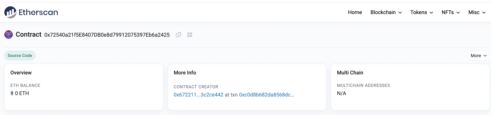
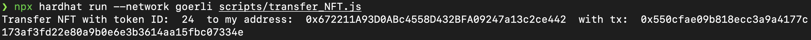
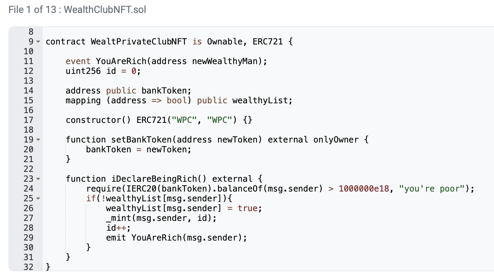

1. Install required modules
   
   ```shell
    $ npm install --save-dev hardhat
    $ npm install --save-dev @nomiclabs/hardhat-ethers 
    $ npm install @openzeppelin/contracts
    $ npm install --save-dev @nomiclabs/hardhat-etherscan
    $ npm install dotenv --save-dev

   ```

2. Create .env file
   
    It should contain API_URL, API_KEY, METAMSK_WALLET_ADDRESS, PRIVATE_KEY, and ETHERSCAN_API_KEY.
    API_URL and API_KEY comes from Alchemy.
    PRIVATE_KEY and METAMSK_WALLET_ADDRESS is your one of metamask wallet's address and corresponding private key.
    ETHERSCAN_API_KEY comes from Etherscan.
   
    To deploy the contract, BANK_TOKEN_ADDRESS and WPC_NFT_CONTRACT_ADDRESS is required.

    After you deploy the contract, it should also contain FLASHLOAN_EXECUTOR_ADDRESS and MINTED_WPC_NFT_TOKENID .

3. Get the NFT
   
   The contract is written in contracts/flash_loan_executor.sol

   ```shell
   $ npx hardhat run --network goerli scripts/deploy_flashloan_executor.js # deploy contract
   ```

   Contract address: 0x72540a21f5E8407DB0e8d79912075397Eb6a2425

   
   

   ```shell
   # execute flashloan on etherscan
   ```

   The transaction that used flashloan: https://goerli.etherscan.io/tx/0x28f3d86e91894f93d228a2df39a9b4e93e24c48c8f7efae5f5d5c8eeaf4a57b0

   
   

   ```shell
   $ npx hardhat run --network goerli scripts/transfer_NFT.js # transfer NFT
   ```

   The transaction that gets your NFT to your own address: https://goerli.etherscan.io/tx/0x550cfae09b818ecc3a9a4177c173af3fd22e80a9b0e6e3b3614aa15fbc07334e

   
   

4. Other things not related to the homework
   
   In BankWithFlashloan contract, it does not say it will interact with WealtPrivateClubNFT contract. Why the gas fee can't be estimated when borrowed amount <= 1,000,000e18?

   
   
   

   A contract (FlashLoanExecutor) with interaction with the NFT contract, the borrowed amount of bank tokens should >= 1,000,001e18 (wei) or the WealtPrivateClubNFT's iDeclareBeingRich function's require condition will fail.

   A contract (BorrowAndReturn) without interaction with the NFT contract, indeed gas fee can be estimated even when the borrowed amount is 1 wei.

   
   
   
   


   It's because the wallet will "simulate" the transaction and see how much gas will be needed. If gas fee cannot be estimated, it means that there is a require condition in one of the contract failed.

