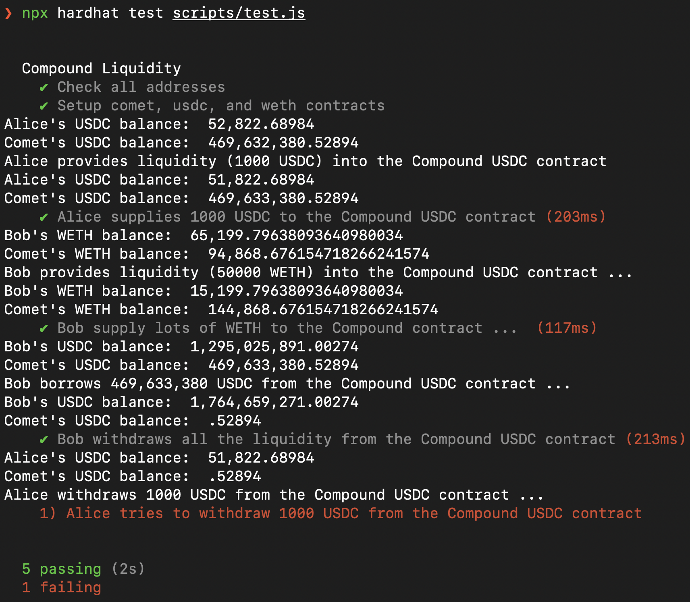
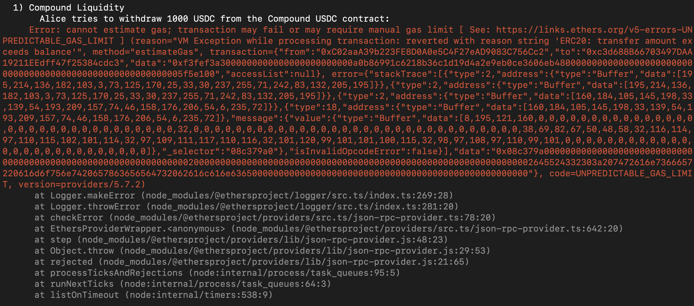

1. Install required modules
   
   ```shell
    $ npm install --save-dev hardhat
    $ npm install --save-dev @nomiclabs/hardhat-ethers 
    $ npm install @openzeppelin/contracts
    $ npm install --save-dev @nomiclabs/hardhat-etherscan
    $ npm install dotenv --save-dev
    $ npm install chai --save-dev

   ```

2. Create .env file
   
    It should contain API_URL, API_KEY, METAMSK_WALLET_ADDRESS, PRIVATE_KEY,  ETHERSCAN_API_KEY, and RICH_ADDRESS.
    API_URL and API_KEY comes from Alchemy.
    PRIVATE_KEY and METAMSK_WALLET_ADDRESS is your one of metamask wallet's address and corresponding private key.
    ETHERSCAN_API_KEY comes from Etherscan.
    RICH_USDC_ADDRESS is set as one of the account in https://etherscan.io/accounts.
    RICH_WETH_ADDRESS is set as one of the account in https://etherscan.io/token/0xc02aaa39b223fe8d0a0e5c4f27ead9083c756cc2#balances.
   
    
3. Demo
   - Forking from mainnet & pinned the spesific block 17228670
   
      ```shell
         $ npx hardhat node --fork https://eth-mainnet.g.alchemy.com/v2/<api_key> --fork-block-number 17228670
      ```

      or just run
         
      ```shell
      $ npx hardhat node
      ```

      since hardhat.config.js has set up the forking.

   - Build the abi of required contracts. The contract interface is written in contracts/contract_interfaces.sol
  
      ```shell
         $ npx hardhat compile
      ```

   - Run the test
      ```shell
      $ npx hardhat test scripts/test.js 
      ```

   -  What happens when Compound has no liquidity
      - [Print] the USDC balance in the Compound USDC contract
      - Alice provides liquidity (1000 USDC) into the Compound USDC contract
      - [Print] the USDC balance in the Compound USDC contract
      - Bob performs some setup … (think about it and try to figure out yourself!)
      - Bob withdraws all the USDC balance
      - [Print] the USDC balance in the Compound USDC contract, this should be 0, or a very small number close to 0
      - [Print] Alice tries to withdraw 1000 USDC, record what happened and print those out
      
      
      

4. References
   
   a. [Compound III Developer FAQ](https://github.com/compound-developers/compound-3-developer-faq)

   b. [Compound III Contract Addresses](https://docs.compound.finance)